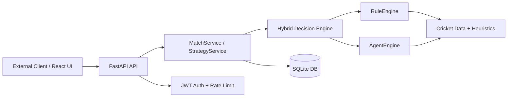

# Cricket Match Intelligence API

An **API-first cricket decision engine** built with **FastAPI**, **JWT auth**, **persistent storage**, and a **hybrid rule + agent analysis pipeline**.

It analyzes live or simulated cricket match states and returns structured outputs such as:
- win probability
- batting and bowling strategy
- what-if simulations
- session-aware trend tracking
- decision recommendations for the next phase of play

> The React dashboard is an optional client. The primary product is the backend API.

---

## Why this project

This project is designed as a **backend system with AI capabilities**, not just a local cricket demo.

It demonstrates:
- **API design** with FastAPI
- **service-oriented backend architecture**
- **hybrid decision logic** (deterministic rules + reflective agent layer)
- **JWT-based authentication**
- **persistent storage** with SQLAlchemy-backed DB models
- **runtime hardening** with caching, rate limiting, and fallback handling

---

## System flow



### Request path

```text
Client → API → Service Layer → Hybrid Engine → Response JSON
```

Example live decision path:

```text
Input: runs=140, wickets=4, overs=15.0
→ StrategyService evaluates match pressure
→ RuleEngine produces safe tactical baseline
→ AgentEngine adds reflective reasoning and matchup insight
→ API returns win %, plan, confidence, and what-if scenarios
```

---

## Core API endpoints

| Method | Path | Purpose |
|--------|------|---------|
| GET | `/health` | Health, cache, rate-limit, and DB status |
| GET | `/api/matches/live` | Fetch available live matches |
| GET | `/api/matches/live/{match_reference}` | Load a specific live match |
| POST | `/api/analysis/run` | Analyze a match state |
| POST | `/api/analysis/prematch` | Toss + XI recommendation |
| GET | `/api/history/{match_key}` | Fetch historical analysis snapshots |
| GET | `/api/session/{session_id}` | Fetch session-level trend context |
| POST | `/api/auth/register` | Register a user and issue JWT |
| POST | `/api/auth/login` | Login and issue JWT |
| GET | `/api/auth/me` | Return current authenticated user |

Interactive docs: `http://localhost:8000/docs`

---

## Example: `POST /api/analysis/run`

### Request

```json
{
  "state": {
    "batting_team": "India",
    "bowling_team": "Australia",
    "innings": 2,
    "runs": 140,
    "wickets": 4,
    "overs": 15.0,
    "target": 182,
    "total_overs": 20,
    "striker": "Suryakumar Yadav",
    "bowler": "Hazlewood"
  }
}
```

### Response

```json
{
  "match_key": "india_vs_australia",
  "session_id": "india_vs_australia-7f454f29",
  "cache_status": "miss",
  "state": {
    "phase": "death",
    "runs_needed": 42,
    "balls_left": 30,
    "estimated_win_probability": 58
  },
  "plan": {
    "strategy": "CALM CLOSE-OUT",
    "target_runs": "7-9",
    "risk_level": "Medium",
    "recommended_action": "Let the best finisher face the majority of the next over and commit to one side of the ground.",
    "bowling_recommended_action": "Miss wide and full, not in the slot, and protect the shorter boundary first."
  },
  "confidence": 74,
  "what_if": [
    {
      "label": "Score 12 next over",
      "win_probability": 62,
      "win_probability_delta": 4,
      "impact": "positive"
    }
  ],
  "engine_meta": {
    "mode": "hybrid",
    "primary_engine": "agent-engine",
    "supporting_engine": "rule-engine",
    "fallback_used": false
  }
}
```

---

## Example: authentication flow

### Register or login

```json
POST /api/auth/login
{
  "email": "demo@example.com",
  "password": "secret123"
}
```

### Auth response

```json
{
  "access_token": "<jwt-token>",
  "token_type": "bearer",
  "user": {
    "id": 2,
    "email": "demo@example.com",
    "display_name": "Demo User"
  }
}
```

Use the token on protected or account-linked requests:

```http
Authorization: Bearer <jwt-token>
```

---

## Tech stack

### Backend
- `FastAPI`
- `SQLAlchemy`
- `PyJWT`
- `Uvicorn`
- in-memory caching + rate limiting

### Frontend
- `React`
- `TypeScript`
- `Vite`

### Current persistence
- **SQLite** by default: `backend/data/app.db`
- **Postgres-ready** through `DATABASE_URL`

---

## Project structure

```text
backend/
  api/
    routes/        # REST endpoints
    middleware/    # rate limiting
    schemas/       # request/response contracts
  services/        # orchestration, auth, storage, live refresh
  core/            # rule engine, agent engine, strategy logic
  db/              # SQLAlchemy setup + models
  data/            # SQLite DB and local JSONL artifacts
frontend/
  src/             # optional UI client for the API
```

---

## Local run

### Backend

```bash
pip install -r backend/requirements.txt
uvicorn backend.main:app --reload --port 8000
```

### Frontend

```bash
cd frontend
npm install
npm run dev
```

---

## Docker run

```bash
docker compose up --build
```

Then open:
- **Frontend:** `http://localhost:8080`
- **Backend API:** `http://localhost:8000`
- **Swagger docs:** `http://localhost:8000/docs`

---

## Environment variables

```bash
ALLOWED_ORIGINS=http://localhost:8080,http://localhost:5173
DATABASE_URL=sqlite:///backend/data/app.db
JWT_SECRET_KEY=replace-with-a-long-random-secret-key-32chars-min
JWT_EXPIRY_MINUTES=720
RATE_LIMIT_REQUESTS=120
RATE_LIMIT_WINDOW_SECONDS=60
LIVE_REFRESH_INTERVAL_SECONDS=30
LIVE_CACHE_TTL_SECONDS=45
```

---

## Engineering highlights

- **Hybrid engine split**: rule-based baseline + reflective agent layer
- **Fallback-safe execution**: graceful degradation if the agent layer fails
- **Session-aware analysis**: trend tracking across repeated requests
- **What-if simulation**: projected outcomes for alternate next-over scenarios
- **Async-safe API design**: thread-offloaded blocking work and background refresh service
- **Auth + persistence**: JWT login and DB-backed history/session storage

---

## Legacy interfaces

`app.py` and `streamlit_app.py` are kept only as reference interfaces from the earlier prototype stage.

The main production-facing path is now:

```text
FastAPI backend + optional React client
```
